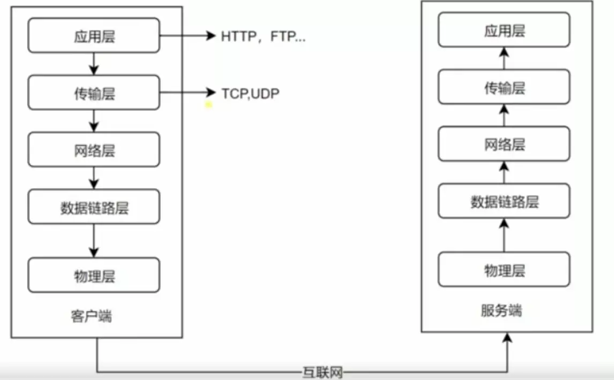

# Summary

- 物理层（physical laye）

> 电压/振幅/波长......

- 链路层（link laye）

以帧(frame)为单位传输（一段有序的0/1序列）  
>关键词： 源（SRC）、宿（DEST）、数据（payload）  
举例：  以太网 、 WIFI

- 网络层（network layer）  

> 关键词： 路由 route / IP

- 传输层（transport layer）

> TCP / UDP  
关键词：端口port

- 应用层（application app）  

> 关键词：HTTP、FTP

五层网络模型图  

